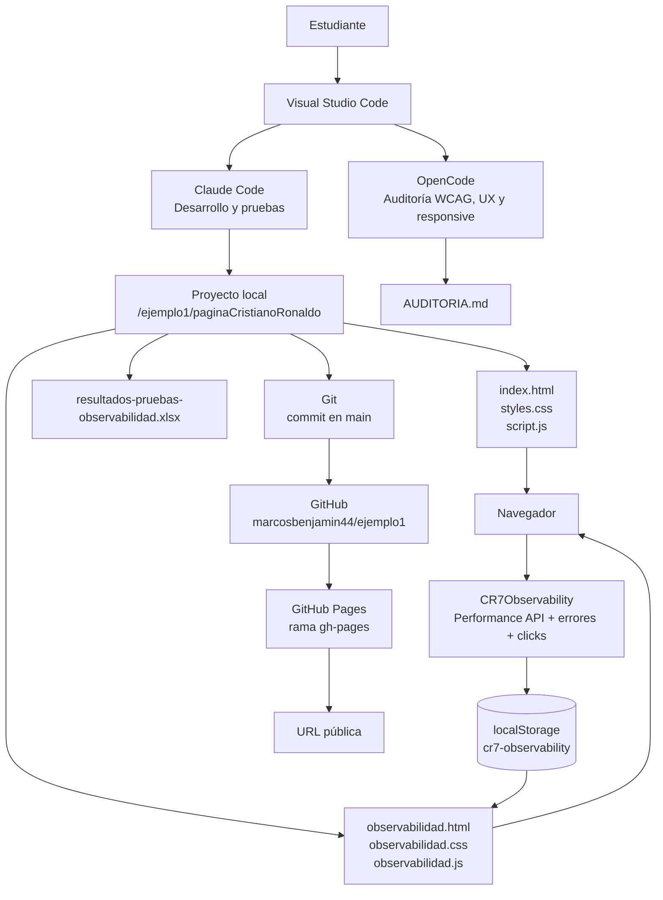

# Proyecto CR7 + Messi: página web estática y observabilidad (v2)

Este repositorio contiene la **versión 2** de un ejercicio completo de desarrollo web estático sobre Cristiano Ronaldo y Lionel Messi. Incluye dos páginas responsive, una auditoría de accesibilidad, un dashboard de observabilidad en el navegador, pruebas funcionales, versionamiento con Git y publicación con GitHub Pages.

## Abrir el proyecto

- **Página publicada:** [Abrir página CR7](https://marcosbenjamin44.github.io/ejemplo1/)
- **Página publicada de Messi:** [Abrir página Messi](https://marcosbenjamin44.github.io/ejemplo1/messi.html)
- **Dashboard de observabilidad:** [Abrir dashboard](https://marcosbenjamin44.github.io/ejemplo1/observabilidad.html)
- **Repositorio:** [github.com/marcosbenjamin44/ejemplo1](https://github.com/marcosbenjamin44/ejemplo1)

## 1. Requisitos

Instala los siguientes programas:

1. **Visual Studio Code:** [code.visualstudio.com/download](https://code.visualstudio.com/download)
2. **Node.js LTS:** [nodejs.org](https://nodejs.org/)
3. **Git:** [git-scm.com/downloads](https://git-scm.com/downloads)

Comprueba la instalación desde una terminal:

```bash
code --version
node --version
npm --version
git --version
```

En Visual Studio Code puedes abrir una terminal con **Terminal > New Terminal**.

## 2. Descargar el proyecto

Clona el repositorio y ábrelo en Visual Studio Code:

```bash
git clone https://github.com/marcosbenjamin44/ejemplo1.git
cd ejemplo1
code .
```

También puedes abrir directamente la carpeta `ejemplo1` desde **File > Open Folder**.

## 3. Estructura del proyecto

```text
ejemplo1/
├── .gitignore
├── README.md
└── paginaCristianoRonaldo/
    ├── index.html
    ├── styles.css
    ├── script.js
    ├── messi.html
    ├── messi.css
    ├── messi.js
    ├── observabilidad.html
    ├── observabilidad.css
    ├── observabilidad.js
    ├── AUDITORIA.md
    └── resultados-pruebas-observabilidad.xlsx
```

## 4. Arquitectura del ejercicio

La solución es una aplicación estática sin backend. El navegador carga los archivos HTML, CSS y JavaScript; `script.js` registra telemetría local y `observabilidad.js` la presenta en el dashboard. GitHub Pages sirve los archivos publicados desde la rama `gh-pages`.



### Componentes

| Componente | Responsabilidad |
|---|---|
| `index.html` | Página principal sobre Cristiano Ronaldo. |
| `messi.html` | Página de Lionel Messi incorporada en la versión 2. |
| `messi.css` | Diseño responsive y accesible de la página de Messi. |
| `messi.js` | Interacciones de la línea de tiempo de Messi. |
| `styles.css` | Diseño visual, responsive, contraste y estados de foco. |
| `script.js` | Interacción de la línea de tiempo y observabilidad del sitio. |
| `observabilidad.html` | Dashboard para consultar las métricas del navegador. |
| `observabilidad.css` | Estilos del dashboard. |
| `observabilidad.js` | Lectura del snapshot, actualización, limpieza y exportación JSON. |
| `AUDITORIA.md` | Informe de OpenCode sobre WCAG, UX y adaptabilidad. |
| `resultados-pruebas-observabilidad.xlsx` | Evidencias y resultados de las pruebas. |
| `main` | Rama con el código fuente, documentación y resultados. |
| `gh-pages` | Rama preparada para servir el sitio publicado. |
| GitHub Pages | Servicio que entrega la web estática en internet. |

## 5. Ejecutar la página localmente

Desde la carpeta del proyecto:

```bash
cd paginaCristianoRonaldo
python3 -m http.server 8000
```

Abre estas direcciones:

- [Página principal local](http://localhost:8000/)
- [Página Messi local](http://localhost:8000/messi.html)
- [Dashboard local](http://localhost:8000/observabilidad.html)

Para detener el servidor, pulsa `Ctrl + C` en la terminal.

> También puedes utilizar la extensión **Live Server** de Visual Studio Code. Instálala desde la vista de extensiones, abre `paginaCristianoRonaldo/index.html` y pulsa **Go Live**.

## 6. Trabajar con dos agentes

El flujo utilizado en este ejercicio es:

- **Claude Code:** desarrollo, implementación y pruebas.
- **OpenCode:** auditoría y revisión independiente.

### Instalar Claude Code

Instala Claude Code siguiendo su documentación oficial:

[code.claude.com/docs](https://code.claude.com/docs/en/overview)

Después autentícate con tu cuenta desde la terminal:

```bash
claude
```

No compartas contraseñas, tokens ni claves API en el código o en el repositorio.

### Instalar OpenCode

En macOS o Linux puedes usar el instalador oficial:

```bash
curl -fsSL https://opencode.ai/install | bash
```

Comprueba ambas herramientas:

```bash
claude --version
opencode --version
```

## 7. Desarrollo con Claude Code

Desde la raíz del sitio:

```bash
cd paginaCristianoRonaldo
claude
```

Ejemplo de solicitud:

```text
Lee AUDITORIA.md y aplica las recomendaciones pendientes de accesibilidad y responsive. Mantén el diseño actual, valida el resultado y no uses frameworks.
```

Antes de aceptar cambios, revisa los archivos modificados y prueba la página en el navegador.

## 8. Auditoría con OpenCode

Desde la carpeta del sitio:

```bash
cd paginaCristianoRonaldo
opencode
```

Solicita una revisión no destructiva:

```text
Audita index.html, styles.css y script.js según WCAG 2.2 AA, UX y adaptabilidad responsive. Clasifica los hallazgos por severidad y escribe las recomendaciones en AUDITORIA.md. No modifiques el código durante esta revisión.
```

El resultado actual está en [paginaCristianoRonaldo/AUDITORIA.md](paginaCristianoRonaldo/AUDITORIA.md).

## 9. Observabilidad

El sitio registra datos únicamente en el navegador y no los envía a un servidor. La instrumentación se encuentra en `script.js` y expone:

```javascript
window.CR7Observability.getSnapshot()
```

Se registran, entre otros:

- Tiempo de navegación y carga mediante `PerformanceNavigationTiming`.
- Errores JavaScript y promesas rechazadas.
- Errores de carga de recursos.
- Clicks en enlaces, botones y controles.
- Cambios de visibilidad de la pestaña.
- Viewport, conexión y soporte de APIs.
- Estado persistido en `localStorage` con el prefijo `cr7-observability`.

En el dashboard puedes actualizar datos, generar un evento de demostración, limpiar el almacenamiento y descargar un snapshot JSON.

## 10. Ejecutar pruebas técnicas

Valida la sintaxis de los archivos JavaScript:

```bash
cd paginaCristianoRonaldo
node --check script.js
node --check observabilidad.js
```

En Visual Studio Code también puedes revisar los diagnósticos de `index.html`, `styles.css`, `script.js`, `observabilidad.html`, `observabilidad.css` y `observabilidad.js`.

Los resultados documentados están en [resultados-pruebas-observabilidad.xlsx](paginaCristianoRonaldo/resultados-pruebas-observabilidad.xlsx), con estas hojas:

- `Resumen`
- `Casos de prueba`
- `Observabilidad`

## 11. Guardar cambios en Git

Desde la raíz del repositorio:

```bash
git status
git add .
git commit -m "docs: add project setup and deployment guide"
git push origin main
```

## 12. Publicar en GitHub Pages

El sitio se publica desde la rama `gh-pages`, que contiene el contenido de `paginaCristianoRonaldo` en su raíz.

Para configurar GitHub Pages desde cero:

1. Abre la sección [Settings > Pages del repositorio](https://github.com/marcosbenjamin44/ejemplo1/settings/pages).
2. En **Build and deployment**, selecciona **Deploy from a branch**.
3. Elige la rama `gh-pages`.
4. Elige la carpeta `/ (root)`.
5. Pulsa **Save**.

La URL pública es:

**[https://marcosbenjamin44.github.io/ejemplo1/](https://marcosbenjamin44.github.io/ejemplo1/)**

El dashboard publicado es:

**[https://marcosbenjamin44.github.io/ejemplo1/observabilidad.html](https://marcosbenjamin44.github.io/ejemplo1/observabilidad.html)**

La página de Messi queda publicada en:

**[https://marcosbenjamin44.github.io/ejemplo1/messi.html](https://marcosbenjamin44.github.io/ejemplo1/messi.html)**

Después de cada cambio en el sitio, actualiza la rama de despliegue desde la raíz del repositorio:

```bash
git subtree push --prefix=paginaCristianoRonaldo origin gh-pages
```

Si GitHub Pages tarda en actualizarse, espera unos minutos y recarga la página con `Cmd + Shift + R` en macOS o `Ctrl + Shift + R` en Windows/Linux.

## 13. Qué hicimos paso a paso

Este fue el recorrido completo del ejercicio, desde el trabajo local hasta la publicación:

1. **Preparamos el entorno local.** Confirmamos macOS, Node.js, npm, Git y Visual Studio Code.
2. **Instalamos los agentes.** Dejamos Claude Code para desarrollar y OpenCode para auditar.
3. **Creamos la carpeta del proyecto.** El desarrollo se realizó dentro de `paginaCristianoRonaldo`.
4. **Construimos la página estática.** Creamos `index.html`, `styles.css` y `script.js`, sin framework ni backend.
5. **Añadimos contenido visual.** Incorporamos cuatro fotografías de Cristiano Ronaldo desde Wikimedia Commons, con textos alternativos.
6. **Probamos la primera versión.** Levantamos un servidor local con `python3 -m http.server 8000` y revisamos escritorio y móvil.
7. **Auditamos el código.** OpenCode revisó accesibilidad WCAG 2.2 AA, UX y responsive, y generó `AUDITORIA.md`.
8. **Aplicamos las correcciones.** Claude Code mejoró contraste, foco, navegación móvil, tabs accesibles, `prefers-reduced-motion` y protección contra overflow.
9. **Creamos observabilidad.** Instrumentamos errores, promesas rechazadas, recursos, navegación, clicks, visibilidad, viewport, conexión y APIs.
10. **Creamos el dashboard.** Añadimos `observabilidad.html`, `observabilidad.css` y `observabilidad.js`, con actualización, limpieza, evento de demostración y exportación JSON.
11. **Ejecutamos pruebas.** Validamos sintaxis con `node --check`, diagnósticos de VS Code, interacción de tabs, menú móvil, persistencia local y ausencia de overflow.
12. **Documentamos los resultados.** Generamos `resultados-pruebas-observabilidad.xlsx` con resumen, casos de prueba y mecanismos observados.
13. **Inicializamos Git.** Creamos el repositorio local, añadimos `.gitignore`, configuramos `origin` y guardamos el primer commit.
14. **Subimos el código a GitHub.** Publicamos la rama `main` en `https://github.com/marcosbenjamin44/ejemplo1`.
15. **Preparamos GitHub Pages.** Generamos la rama `gh-pages` con el contenido del sitio en su raíz.
16. **Activamos el despliegue.** Configuramos GitHub Pages para servir `gh-pages` desde `/ (root)`.
17. **Añadimos esta guía.** Documentamos el proceso completo y publicamos el README en `main`.
18. **Creamos la versión 2.** Añadimos `messi.html`, `messi.css` y `messi.js` con trayectoria, estadísticas, galería e imágenes de Lionel Messi.
19. **Integramos la navegación.** Añadimos enlaces a Messi desde CR7 y desde el dashboard de observabilidad.
20. **Versionamos el cambio.** Guardamos la ampliación como un nuevo commit y la identificamos con la etiqueta Git `v2.0.0`.

### Versionamiento del proyecto

La rama `main` contiene el código fuente y la rama `gh-pages` contiene la versión desplegable. Para consultar versiones:

```bash
git log --oneline --decorate
git tag --list
```

Para crear una nueva versión después de realizar cambios:

```bash
git add .
git commit -m "feat: add next project version"
git tag -a v2.0.0 -m "Version 2: add Messi page"
git push origin main --tags
git subtree push --prefix=paginaCristianoRonaldo origin gh-pages
```

> Si la etiqueta `v2.0.0` ya existe, usa la siguiente versión semántica, por ejemplo `v2.1.0` para nuevas funcionalidades o `v2.0.1` para correcciones.

## 14. Recomendaciones para estudiantes

- Usa HTML semántico antes de añadir `div` innecesarios.
- Escribe textos alternativos descriptivos para las imágenes.
- Prueba el teclado sin usar el mouse.
- Comprueba el sitio en móvil y escritorio.
- No guardes contraseñas, tokens o claves API en Git.
- Revisa los cambios con `git diff` antes de hacer commit.
- Haz commits pequeños y con mensajes descriptivos.
- Usa la auditoría para corregir problemas, no solo para documentarlos.

## 15. Licencia y contenido

Este es un ejercicio educativo. Las imágenes utilizadas proceden de Wikimedia Commons y mantienen sus condiciones de uso y atribución correspondientes. El sitio no es oficial ni está afiliado a Cristiano Ronaldo.