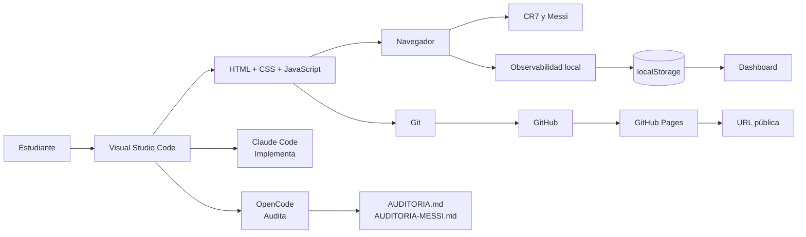
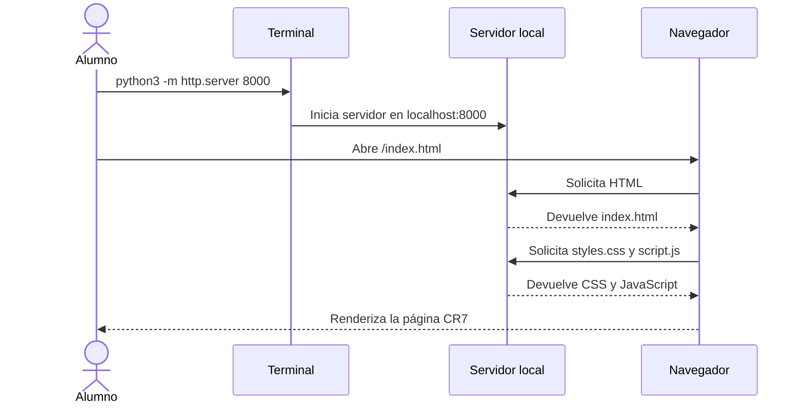
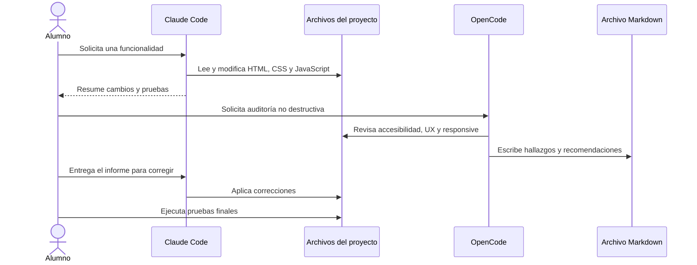
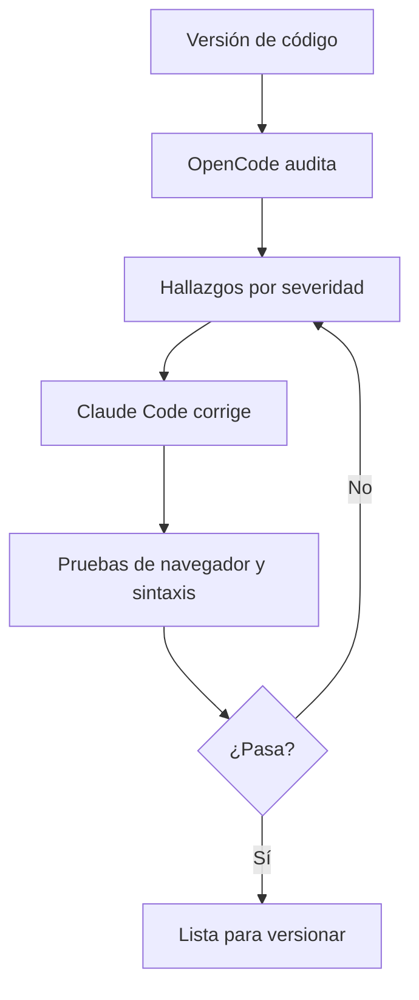
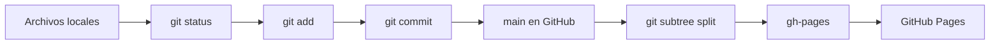
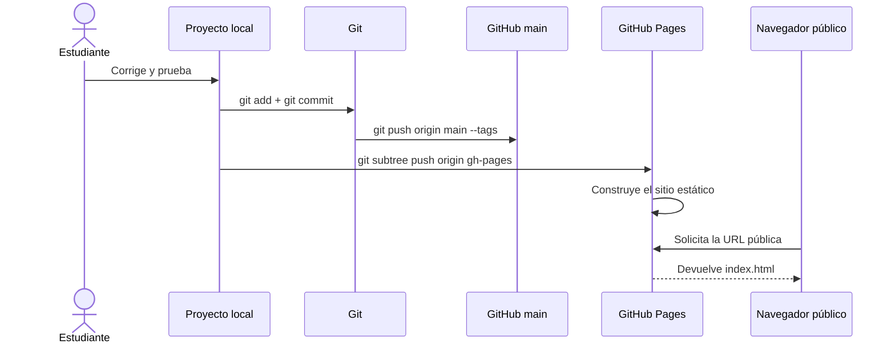

# Guía completa del ejercicio: CR7 + Messi

## Desarrollo web estático, auditoría, observabilidad y GitHub Pages

Esta guía permite reproducir el ejercicio desde un computador sin herramientas instaladas. Está escrita para estudiantes que empiezan desde cero y acompaña todo el recorrido:

1. Preparar el computador.
2. Instalar Visual Studio Code, Node.js y Git.
3. Crear y ejecutar una página web local.
4. Trabajar con Claude Code para desarrollar.
5. Trabajar con OpenCode para auditar.
6. Corregir accesibilidad y responsive.
7. Añadir observabilidad en el navegador.
8. Ejecutar pruebas.
9. Guardar el trabajo con Git.
10. Subirlo a GitHub.
11. Publicarlo con GitHub Pages.
12. Crear una versión `v2.0.0` con una página de Lionel Messi.

> **Proyecto terminado:** [Abrir página CR7](https://marcosbenjamin44.github.io/ejemplo1/) · [Abrir página Messi](https://marcosbenjamin44.github.io/ejemplo1/messi.html) · [Abrir dashboard](https://marcosbenjamin44.github.io/ejemplo1/observabilidad.html)

---

## 0. Antes de comenzar

### Qué vamos a construir

El resultado será un sitio estático compuesto por:

- Una página sobre Cristiano Ronaldo.
- Una página sobre Lionel Messi.
- Un dashboard de observabilidad.
- Una auditoría de accesibilidad y experiencia de usuario.
- Un archivo Excel con resultados de pruebas.
- Un repositorio GitHub y un despliegue público.

### Qué no necesitamos

No necesitamos una base de datos, un servidor backend, React, Vue, Angular ni una cuenta de hosting adicional. El navegador ejecutará HTML, CSS y JavaScript, y GitHub Pages servirá los archivos estáticos.

### Arquitectura general



---

## 1. Identificar el sistema operativo

La guía funciona en macOS, Windows y Linux. Los comandos cambian ligeramente según el sistema.

### macOS

Abre **Terminal** con `Cmd + Espacio`, escribe `Terminal` y pulsa Enter.

### Windows

Abre **PowerShell** desde el menú Inicio. También puedes usar la terminal integrada de Visual Studio Code.

### Linux

Abre **Terminal** desde el menú de aplicaciones o con el atajo configurado por tu distribución.

---

## 2. Instalar Visual Studio Code

1. Abre [code.visualstudio.com/download](https://code.visualstudio.com/download).
2. Descarga la versión de tu sistema operativo.
3. Ejecuta el instalador.
4. Acepta las opciones recomendadas.
5. Abre Visual Studio Code.

### Comprobar la instalación

En macOS y Linux:

```bash
code --version
```

En Windows, si `code` no es reconocido, abre Visual Studio Code manualmente. Después usa **Terminal > New Terminal** para continuar desde la terminal integrada.

### Extensiones recomendadas

En Visual Studio Code abre la vista de extensiones con `Ctrl + Shift + X` o `Cmd + Shift + X` en macOS e instala:

- **Live Server**, para servir páginas HTML localmente.
- **HTML CSS Support**, para completar clases y estilos.
- **Prettier**, opcional, para formatear archivos.

No son obligatorias para ejecutar el proyecto; `python3 -m http.server` también funciona.

---

## 3. Instalar Node.js

1. Abre [nodejs.org](https://nodejs.org/).
2. Descarga la versión **LTS**.
3. Ejecuta el instalador con las opciones recomendadas.
4. Cierra y vuelve a abrir la terminal.

Comprueba la instalación:

```bash
node --version
npm --version
```

Debes obtener dos números de versión. No es necesario instalar paquetes npm para este proyecto.

---

## 4. Instalar Git

Descarga Git desde [git-scm.com/downloads](https://git-scm.com/downloads).

### macOS

Puedes instalarlo desde el instalador oficial o, si ya tienes Homebrew:

```bash
brew install git
```

### Windows

Instala **Git for Windows** y deja seleccionadas las opciones recomendadas. Git Bash y PowerShell funcionarán para este ejercicio.

### Linux basado en Debian/Ubuntu

```bash
sudo apt update
sudo apt install git
```

Comprueba Git:

```bash
git --version
```

Configura tu identidad una sola vez. Usa tu propio nombre y correo de GitHub:

```bash
git config --global user.name "Tu Nombre"
git config --global user.email "tu-correo@example.com"
```

> No uses el correo ni las credenciales de otra persona. Nunca guardes contraseñas, tokens o claves API dentro del proyecto.

---

## 5. Crear o clonar el proyecto

### Opción recomendada: clonar el proyecto terminado

Abre una terminal y ejecuta:

```bash
git clone https://github.com/marcosbenjamin44/ejemplo1.git
cd ejemplo1
code .
```

La carpeta descargada tendrá esta estructura:

```text
ejemplo1/
├── .gitignore
├── README.md
├── READMEGUIA.md
└── paginaCristianoRonaldo/
    ├── index.html
    ├── styles.css
    ├── script.js
    ├── messi.html
    ├── messi.css
    ├── messi.js
    ├── observabilidad.html
    ├── observabilidad.css
    ├── observabilidad.js
    ├── AUDITORIA.md
    ├── AUDITORIA-MESSI.md
    └── resultados-pruebas-observabilidad.xlsx
```

### Opción didáctica: crear el proyecto vacío

Para practicar desde cero:

```bash
mkdir ejemplo1
cd ejemplo1
git init -b main
mkdir paginaCristianoRonaldo
code .
```

Después crea los archivos con el explorador de Visual Studio Code o pide a Claude Code que los genere siguiendo las instrucciones de las siguientes secciones.

---

## 6. Ejecutar el sitio localmente

Desde la raíz del repositorio:

```bash
cd paginaCristianoRonaldo
python3 -m http.server 8000
```

Si tu sistema no tiene `python3`, prueba:

```bash
python -m http.server 8000
```

Abre en el navegador:

- [http://localhost:8000/](http://localhost:8000/)
- [http://localhost:8000/messi.html](http://localhost:8000/messi.html)
- [http://localhost:8000/observabilidad.html](http://localhost:8000/observabilidad.html)

### Diagrama de carga local



Para detener el servidor, vuelve a la terminal y pulsa `Ctrl + C`.

### Alternativa con Live Server

1. Abre `paginaCristianoRonaldo/index.html`.
2. Haz clic derecho sobre el archivo.
3. Selecciona **Open with Live Server**.
4. Se abrirá una URL parecida a `http://127.0.0.1:5500/...`.

---

## 7. Instalar y usar los dos agentes

El flujo del curso separa las responsabilidades:

| Herramienta | Uso |
|---|---|
| Claude Code | Crear, modificar y probar código. |
| OpenCode | Auditar accesibilidad, UX y adaptabilidad. |

### Claude Code

Instala Claude Code siguiendo la documentación oficial:

[code.claude.com/docs](https://code.claude.com/docs/en/overview)

Después inicia sesión desde la terminal:

```bash
claude
```

Comprueba que funciona:

```bash
claude --version
```

### OpenCode

En macOS y Linux:

```bash
curl -fsSL https://opencode.ai/install | bash
```

En Windows consulta las alternativas oficiales en [opencode.ai/docs](https://opencode.ai/docs/).

Comprueba la instalación:

```bash
opencode --version
```

### Secuencia de trabajo con agentes



---

## 8. Crear la primera versión: CR7

Desde `paginaCristianoRonaldo/`, abre Claude Code:

```bash
claude
```

Usa una instrucción concreta como esta:

```text
Crea una página web estática en español sobre Cristiano Ronaldo. Usa index.html, styles.css y script.js sin frameworks. Incluye al menos tres fotografías reales con texto alternativo, una trayectoria interactiva, estadísticas, galería, diseño responsive y navegación accesible. Mantén todo dentro de paginaCristianoRonaldo. Valida la página localmente.
```

Después revisa que existan:

```text
index.html
styles.css
script.js
```

Prueba:

- La página carga.
- Los enlaces funcionan.
- Las imágenes tienen `alt`.
- La página funciona en escritorio y móvil.
- La navegación de la trayectoria responde al teclado.

---

## 9. Auditar la primera versión con OpenCode

En la terminal, dentro de `paginaCristianoRonaldo/`:

```bash
opencode
```

Solicita una auditoría sin modificaciones:

```text
Audita index.html, styles.css y script.js según WCAG 2.2 AA, UX y adaptabilidad responsive. Revisa estructura semántica, contraste, teclado, foco, ARIA, textos alternativos, navegación móvil y overflow. No modifiques el código. Devuelve un informe Markdown con severidad, evidencia y recomendaciones.
```

Guarda el resultado como:

```text
AUDITORIA.md
```

### Ciclo auditoría-corrección



---

## 10. Aplicar correcciones con Claude Code

Entrega el informe a Claude Code:

```text
Lee AUDITORIA.md y aplica las recomendaciones de accesibilidad y responsive. Prioriza los hallazgos altos y medios. Mantén el diseño, no uses frameworks, valida HTML/CSS/JavaScript y prueba escritorio y móvil.
```

Después verifica los archivos modificados:

```bash
git status
git diff --check
```

No publiques todavía si la auditoría tiene problemas pendientes.

---

## 11. Añadir observabilidad

La observabilidad de este proyecto no usa backend. Los datos viven en el navegador de cada estudiante.

### Qué registra

- Tiempo de carga y navegación.
- Errores JavaScript.
- Promesas rechazadas.
- Errores de recursos.
- Clicks en enlaces y botones.
- Cambios de visibilidad de la pestaña.
- Viewport, conexión y soporte de APIs.

### Cómo consultar el snapshot

En la consola del navegador:

```javascript
window.CR7Observability.getSnapshot()
```

La clave usa el prefijo:

```text
cr7-observability
```

### Probar el dashboard

Abre `observabilidad.html` y prueba, en este orden:

1. **Actualizar datos**.
2. **Generar evento de demostración**.
3. Confirmar que sube el contador de interacciones.
4. **Descargar snapshot JSON**.
5. Revisar el archivo descargado.
6. **Limpiar almacenamiento local** solo si quieres reiniciar las métricas.

---

## 12. Crear la versión 2: Messi

Una vez corregida y auditada la versión CR7, pide a Claude Code:

```text
Crea la versión 2 del proyecto. Añade messi.html, messi.css y messi.js dentro de paginaCristianoRonaldo. Diseña una página accesible y responsive dedicada a Lionel Messi, con al menos tres fotografías reales con alt, trayectoria interactiva, estadísticas, galería y enlaces a CR7 y observabilidad. Conserva todo lo existente.
```

La página local será:

[http://localhost:8000/messi.html](http://localhost:8000/messi.html)

### Auditar Messi antes de publicar

Usa OpenCode con una instrucción específica:

```text
Audita messi.html, messi.css y messi.js junto con sus enlaces desde index.html y observabilidad.html. Revisa WCAG 2.2 AA, contraste, foco, ARIA, teclado, objetivos táctiles, imágenes, UX y overflow en 320px, 390px y 768px. No modifiques archivos. Devuelve un informe Markdown breve.
```

Guarda el informe como:

```text
AUDITORIA-MESSI.md
```

Después entrega el informe a Claude Code:

```text
Lee AUDITORIA-MESSI.md y corrige todos los hallazgos altos y medios. No publiques hasta que las pruebas responsive y de contraste pasen.
```

---

## 13. Pruebas mínimas antes de publicar

### Sintaxis JavaScript

```bash
cd paginaCristianoRonaldo
node --check script.js
node --check observabilidad.js
node --check messi.js
```

Resultado esperado: no debe aparecer ningún mensaje de error.

### Diagnósticos de Visual Studio Code

Abre estos archivos y revisa el panel **Problems**:

```text
index.html
styles.css
script.js
messi.html
messi.css
messi.js
observabilidad.html
observabilidad.css
observabilidad.js
```

Resultado esperado: `No errors found`.

### Prueba responsive

En el navegador:

1. Abre las herramientas de desarrollador.
2. Activa el modo dispositivo móvil.
3. Prueba anchos de 320 px, 390 px, 768 px y escritorio.
4. Comprueba que no exista una barra horizontal inesperada.
5. Comprueba que los botones y enlaces se puedan pulsar.
6. Navega solo con teclado usando Tab, Enter, Espacio, flechas, Home y End.

### Prueba de imágenes

Cada imagen debe:

- Cargar correctamente.
- Tener `alt` descriptivo.
- Mantener proporción sin deformarse.
- Tener crédito o fuente documentada cuando corresponda.

### Resultados

Los resultados del ejercicio original están en:

[resultados-pruebas-observabilidad.xlsx](paginaCristianoRonaldo/resultados-pruebas-observabilidad.xlsx)

---

## 14. Guardar el trabajo con Git

Desde la raíz de `ejemplo1`:

```bash
git status
git add .
git diff --cached --stat
git commit -m "feat: describe the change"
git log --oneline --decorate -5
```

Si todo está correcto, conecta GitHub:

```bash
git remote add origin https://github.com/TU_USUARIO/TU_REPOSITORIO.git
git branch -M main
git push -u origin main
```

En este ejercicio el remoto es:

```text
https://github.com/marcosbenjamin44/ejemplo1.git
```

### Flujo Git recomendado



---

## 15. Crear la etiqueta de versión 2

Para identificar la entrega con Messi:

```bash
git add .
git commit -m "feat: release version 2 with Messi page"
git tag -a v2.0.0 -m "Version 2: add Lionel Messi page"
git push origin main --tags
```

Consulta la versión:

```bash
git tag --list
git show v2.0.0 --stat
```

Regla recomendada:

- `v1.0.0`: primera versión estable.
- `v2.0.0`: nueva funcionalidad importante, como la página Messi.
- `v2.0.1`: corrección pequeña.
- `v2.1.0`: nueva funcionalidad compatible.

---

## 16. Publicar en GitHub Pages

La rama `gh-pages` debe tener `index.html` en su raíz. Como el código fuente está dentro de `paginaCristianoRonaldo`, usa:

```bash
git subtree push --prefix=paginaCristianoRonaldo origin gh-pages
```

En GitHub:

1. Abre **Settings** del repositorio.
2. Entra en **Pages**.
3. En **Build and deployment**, elige **Deploy from a branch**.
4. Selecciona `gh-pages`.
5. Selecciona `/ (root)`.
6. Pulsa **Save**.

### Flujo de publicación



### URLs del ejercicio terminado

- [CR7](https://marcosbenjamin44.github.io/ejemplo1/)
- [Messi](https://marcosbenjamin44.github.io/ejemplo1/messi.html)
- [Observabilidad](https://marcosbenjamin44.github.io/ejemplo1/observabilidad.html)
- [Repositorio GitHub](https://github.com/marcosbenjamin44/ejemplo1)

---

## 17. Problemas frecuentes

### `git: command not found`

Git no está instalado o la terminal no se reinició después de instalarlo. Instálalo, cierra la terminal y abre una nueva.

### `node: command not found`

Instala Node.js LTS desde [nodejs.org](https://nodejs.org/) y reinicia la terminal.

### `code: command not found`

Abre Visual Studio Code manualmente. En macOS usa **Cmd + Shift + P**, busca **Shell Command: Install 'code' command in PATH** y ejecútalo.

### `python3: command not found`

Prueba `python`. Si tampoco existe, usa la extensión Live Server de Visual Studio Code.

### El puerto 8000 está ocupado

Usa otro puerto:

```bash
python3 -m http.server 8080
```

Después abre [http://localhost:8080/](http://localhost:8080/).

### Las imágenes no aparecen

Comprueba la conexión a internet. Las imágenes usan URLs externas. Revisa también que la URL esté completa y que no tenga espacios.

### GitHub Pages muestra 404

Comprueba en **Settings > Pages** que la fuente sea `gh-pages` y `/ (root)`. Espera unos minutos después del primer despliegue y recarga con `Ctrl + Shift + R` o `Cmd + Shift + R`.

### Claude Code o OpenCode piden autenticación

Completa el inicio de sesión oficial desde la terminal. No pegues contraseñas, tokens o claves en el README, en el código ni en el chat.

### El estudiante no tiene permiso para crear el repositorio

El docente debe crear el repositorio o invitar al estudiante como colaborador. Cada estudiante debe usar su propia cuenta y su propio remoto.

---

## 18. Lista final de comprobación

Antes de entregar, marca todo:

- [ ] Visual Studio Code instalado.
- [ ] Node.js y npm funcionan.
- [ ] Git funciona y tiene nombre/correo configurados.
- [ ] El proyecto abre en `localhost`.
- [ ] CR7 funciona en escritorio y móvil.
- [ ] Messi funciona en escritorio y móvil.
- [ ] El dashboard muestra métricas.
- [ ] La auditoría de OpenCode está documentada.
- [ ] Las correcciones de Claude Code están aplicadas.
- [ ] `node --check` pasa en los tres JavaScript.
- [ ] No hay errores en Problems de Visual Studio Code.
- [ ] `git status` fue revisado.
- [ ] Existe un commit descriptivo.
- [ ] Existe la etiqueta `v2.0.0`.
- [ ] `main` fue subido a GitHub.
- [ ] `gh-pages` fue actualizado.
- [ ] La URL pública responde correctamente.

## 19. Entrega

Entrega al docente:

1. La URL del repositorio GitHub.
2. La URL pública de GitHub Pages.
3. La URL del dashboard.
4. La URL de la página Messi.
5. El commit o etiqueta de la versión entregada.
6. Los archivos `AUDITORIA.md`, `AUDITORIA-MESSI.md` y el Excel de pruebas.

**Resultado esperado:** un sitio funcional, accesible, probado, versionado y publicado, reproducible por otra persona siguiendo esta guía desde un computador limpio.
